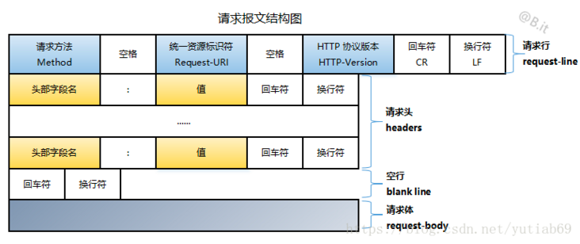
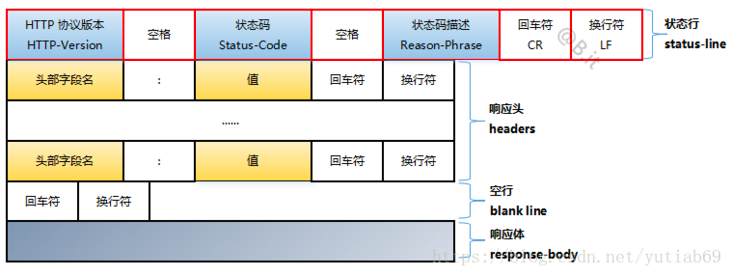

## HTTP概述
HTTP(Hyper Text Transfer Protocol)是一个基于TCP/IP通信协议的应用层数据传输协议  

## HTTP协议特点

- 简单  
    HTTP的报文在测试和阅读方面是友好的
  
- 可扩展  
    客户端和服务端可以定制headers语义，用来实现缓存、传输不同数据类型、权限控制等
  
- 无状态  
    两个请求之间没有关系，HTTP对事务处理没有记忆能力，但可以通过HTTP Cookies实现会话  
    如果一个请求需要前面的请求数据，则必须重传。好处是不需要前面的数据时，服务端应答很快

- 无连接  
    在早期互联网，服务端和客户端数据传输间歇较大(突发性，瞬时性)，
  并且网页浏览的联想性、发散性导致两次传送的数据关联性很低，大部分通道实际上会很空闲、无端占用资源。
  因此 HTTP 的设计者有意利用这种特点将协议设计为请求时建连接、请求完释放连接，以尽快将资源释放出来服务其他客户端。  
  随着网页越来越复杂，HTTP/1.1 之后的协议都支持长连接
  
## HTTP报文

### 请求

- 请求行  
    包含协议版本、状态码、状态码描述
  
- 请求头  
    和服务端定制的协议扩展
  
- 请求体，可选  
    发送的数据



### 响应

- 状态行  
  包含请求方法、请求路径、协议版本

- 响应头  
  类似请求头

- 响应体，可选  
  接收的数据




## HTTP传输过程
1. 打开一个 TCP 连接：TCP 连接被用来发送一条或多条请求，以及接受响应消息。客户端可能打开一条新的连接，或重用一个已经存在的连接，或者也可能开几个新的 TCP 连接连向服务端  


2. 发送一个 HTTP 报文：HTTP 报文（在 HTTP/2 之前）是语义可读的。在 HTTP/2 中，这些简单的消息被封装在了帧中，这使得报文不能被直接读取，但是原理仍是相同的

    ```text 
    GET / HTTP/1.1
    Host: developer.mozilla.org
    Accept-Language: fr
    ```

3. 读取服务端返回的报文信息

    ```text 
    HTTP/1.1 200 OK
    Date: Sat, 09 Oct 2010 14:28:02 GMT
    Server: Apache
    Last-Modified: Tue, 01 Dec 2009 20:18:22 GMT
    ETag: "51142bc1-7449-479b075b2891b"
    Accept-Ranges: bytes
    Content-Length: 29769
    Content-Type: text/html

    <!DOCTYPE html... (here comes the 29769 bytes of the requested web page)
    ```
4. 关闭连接或者为后续请求重用连接

> 当 HTTP 流水线启动时，后续请求都可以不用等待第一个请求的成功响应就被发送。然而 HTTP 流水线已被证明很难在现有的网络中实现，因为现有网络中有很多老旧的软件与现代版本的软件共存。因此，HTTP 流水线已被在有多请求下表现得更稳健的 HTTP/2 的帧所取代

## 总结
HTTP 是一种简单可扩展的协议，
其 Client-Server 的结构以及轻松扩展头部信息的能力使得 HTTP 可以和 Web 共同发展。

即使 HTTP/2 为了提高性能将 HTTP 报文嵌入到帧中这一举措增加了复杂度，
但是从 Web 应用的角度看，报文的基本结构没有变化，从 HTTP/1.0 发布起就是这样的结构。
会话流依旧简单，通过一个简单的 HTTP message monitor就可以查看和纠错