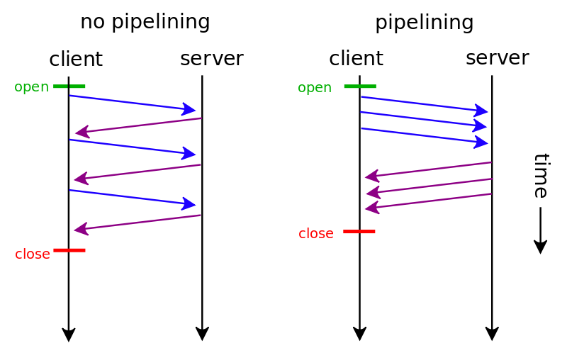

## HTTP的发展
> **HTTP（**HyperText Transfer Protocol）是万维网（World Wide Web）的基础协议。
> 自 Tim Berners-Lee 博士和他的团队在 1989-1991 年间创造出它以来，
> HTTP 已经发生了太多的变化，在保持协议简单性的同时，不断扩展其灵活性。
> 如今，HTTP 已经从一个只在实验室之间交换文件的早期协议进化到了可以传输图片，
> 高分辨率视频和 3D 效果的现代复杂互联网协议

## HTTP/0.9 – 单行协议


> 1989 年，当时在 CERN 工作的 Tim Berners-Lee 博士写了一份关于建立一个通过网络传输超文本系统的报告。这个系统起初被命名为 Mesh，在随后的 1990 年项目实施期间被更名为万维网（*World Wide Web）。*它在现有的 TCP 和 IP 协议基础之上建立，由四个部分组成：

> - 一个用来表示超文本文档的文本格式，超文本标记语言（HTML）。
> - 一个用来交换超文本文档的简单协议，超文本传输协议（HTTP）。
> - 一个显示（以及编辑）超文本文档的客户端，即网络浏览器。第一个网络浏览器被称为 WorldWideWeb。
> - 一个服务器用于提供可访问的文档，即 httpd 的前身。
  这四个部分完成于 1990 年底，且第一批服务器已经在 1991 年初在 CERN 以外的地方运行了。1991 年 8 月 16 日，Tim Berners-Lee 在公开的超文本新闻组上发表的文章被视为是万维网公共项目的开始。

HTTP 在应用的早期阶段非常简单，后来被称为 HTTP/0.9，有时也叫做单行（one-line）协议

最初版本的 HTTP 协议并没有版本号，后来它的版本号被定位在 0.9 以区分后来的版本。HTTP/0.9 极其简单：请求由单行指令构成，以唯一可用方法GET开头，其后跟目标资源的路径（一旦连接到服务器，协议、服务器、端口号这些都不是必须的）。

```text 
GET /page.html
```

响应也极其简单的：只包含响应文档本身。

```text 
<HTML>
这是一个非常简单的 HTML 页面
</HTML>
```

跟后来的版本不同，HTTP/0.9 的响应内容并不包含 HTTP 头，这意味着只有 HTML 文件可以传送，无法传输其他类型的文件；也没有状态码或错误代码：一旦出现问题，一个特殊的包含问题描述信息的 HTML 文件将被发回，供人们查看

## HTTP/1.0 – 扩展性

由于 HTTP/0.9 协议的应用十分有限，浏览器和服务器迅速扩展内容使其用途更广：

- 协议版本信息现在会随着每个请求发送（HTTP/1.0被追加到了GET行）。
- 状态码会在响应开始时发送，使浏览器能了解请求执行成功或失败，并相应调整行为（如更新或使用本地缓存）。
- 引入了 HTTP 头的概念，无论是对于请求还是响应，允许传输元数据，使协议变得非常灵活，更具扩展性。
- 在新 HTTP 头的帮助下，具备了传输除纯文本 HTML 文件以外其他类型文档的能力（凭借Content-Type头）。

1996年的文档 RFC 1945 定义了 HTTP/1.0，但它是狭义的，并不是官方标准


## HTTP/1.1 – 标准协议

HTTP/1.0 多种不同的实现方式在实际运用中显得有些混乱，自 1995 年开始，即 HTTP/1.0 文档发布的下一年，就开始修订 HTTP 的第一个标准化版本。在 1997 年初，HTTP1.1 标准发布，就在 HTTP/1.0 发布的几个月后。

HTTP/1.1 消除了大量歧义内容并引入了多项改进

- 连接可复用  
  > 节省了多次打开 TCP 连接加载网页文档资源的时间  
  > 在 HTTP 1.1 中， Connection: Keep-Alive 字段默认开启  
  > Keep-Alive 字段值  
  > timeout: 决定当前 tcp的最长保持连接时间，单位为秒  
  > max：决定了当前连接最多的可复用次数


- 增加流水线技术  
  > 将多个HTTP请求（request）整批送出的技术，而在传送过程中不需先等待服务器的回应  
  > 只有 GET 和 HEAD 等要求可以进行管线化，非幂等的方法，例如POST将不会被管线化
  > 
- 引入额外的缓存控制机制
  >相比 HTTP 1.0，HTTP 1.1 新增了若干项缓存机制：
  >
  >If-Modefied-Since  
  >If-Unmodified-Since  
  >If-Match  
  >If-None-Match  
  >ET-tag  
  >详细的缓存机制将在HTTP缓存中讨论
- 引入内容协商机制，包括语言，编码，类型等，并允许客户端和服务器之间约定以最合适的内容进行交换。
  > 在长连接请求中，无法继续使用之前的方法来判断数据是否完全发送完毕，但是我们可以根据 Content-Length 的长度是否为 0 来判断数据是否传输完毕，请求传输的内容与长度必须保持一致，否则内容将会被截断  
  > 使用 Transfer-Encoding配合 Content-Encoding来告诉浏览器传输的结果，Transfer-Encoding的常用值为 chunked ，而 Content-Encoding的作用是告知浏览器采用何种编码（压缩），通常使用的是 gzip  。对资源进行压缩后，再对内容进行分块传输。当最后一个分块长度为0时，则代表数据传输完成
- Host头  
  >能够使不同域名配置在同一个 IP 地址的服务器上

  
```text 
GET /static/img/header-background.png HTTP/1.1
Host: developer.mozilla.org
User-Agent: Mozilla/5.0 (Macintosh; Intel Mac OS X 10.9; rv:50.0) Gecko/20100101 Firefox/50.0
Accept: */*
Accept-Language: en-US,en;q=0.5
Accept-Encoding: gzip, deflate, br
Referer: https://developer.mozilla.org/en-US/docs/Glossary/Simple_header

200 OK
Age: 9578461
Cache-Control: public, max-age=315360000
Connection: keep-alive
Content-Length: 3077
Content-Type: image/png
Date: Thu, 31 Mar 2016 13:34:46 GMT
Last-Modified: Wed, 21 Oct 2015 18:27:50 GMT
Server: Apache

(image content of 3077 bytes)
```


HTTP/1.1 在 1997 年 1 月以 RFC 2068 文件发布

## 超过15年的发展

1. HTTPS安全传输 - 基于TLS的加密传输
2. 新的HTTP模式REST - 通过RESTful API查看和修改资源

## HTTP/2.0 - 更优的性能
这些年来，网页愈渐变得的复杂，甚至演变成了独有的应用，可见媒体的播放量，增进交互的脚本大小也增加了许多：更多的数据通过 HTTP 请求被传输。HTTP/1.1 链接需要请求以正确的顺序发送，理论上可以用一些并行的链接（尤其是 5 到 8 个），带来的成本和复杂性堪忧。比如，HTTP 管线化（pipelining）就成为了 Web 开发的负担

IETF组织在2015年正式标准化HTTP/2.0协议，HTTP/2 在 HTTP/1.1 有几处基本的不同

- 二进制取代文本
  > 基于二进制的http2可以使成帧的使用变得更为便捷。在HTTP1.1和其他基于文本的协议中，对帧的起始和结束识别起来相当复杂。而通过移除掉可选的空白符以及其他冗余后，再来实现这些会变得更容易。  
  > 而另一方面，这项决议同样使得我们可以更加便捷的从帧结构中分离出那部分协议本身的内容。而在HTTP1中，各个部分相互交织，犹如一团乱麻
- 多路复用
  > 并行的请求能在同一个链接中处理，移除了 HTTP/1.x 中顺序和阻塞的约束。
- 头部压缩
  > 因为 headers 在一系列请求中常常是相似的，其移除了重复和传输重复数据的成本

- 请求重置  
  > HTTP 1.1的有一个缺点是：当一个含有确切值的Content-Length的HTTP消息被送出之后，你就很难中断它了。当然，通常你可以断开整个TCP链接（但也不总是可以这样），但这样导致的代价就是需要通过三次握手来重新建立一个新的TCP连接。  
  一个更好的方案是只终止当前传输的消息并重新发送一个新的。在http2里面，我们可以通过发送RST_STREAM帧来实现这种需求，从而避免浪费带宽和中断已有的连接
- 服务器推送  
  > 这个功能通常被称作“缓存推送”。主要的思想是：当一个客户端请求资源X，而服务器知道它很可能也需要资源Z的情况下，服务器可以在客户端发送请求前，主动将资源Z推送给客户端。这个功能帮助客户端将Z放进缓存以备将来之需。  
  > 服务器推送需要客户端显式的允许服务器提供该功能。但即使如此，客户端依然能自主选择是否需要中断该推送的流。如果不需要的话，客户端可以通过发送一个RST_STREAM帧来中止。
- 流量控制
  > 每个http2流都拥有自己的公示的流量窗口，它可以限制另一端发送数据。如果你正好知道SSH的工作原理的话，这两者非常相似。  
  > 对于每个流来说，两端都必须告诉对方自己还有足够的空间来处理新的数据，而在该窗口被扩大前，另一端只被允许发送这么多数据。
  > 而只有数据帧会受到流量控制
  


## 关于HTTP1.1的优化

**队头阻塞**  
HTTP/1.1 流水线允许客户端批量发送请求，在发送过程中不需要等待服务器对前一个请求的响应，但是还是要按照发送请求的顺序来接收响应  

如果同时发送多个请求，第一个请求非常耗时，将会阻塞后续的所有请求

**雪碧图**  
Spriting是一种将很多较小的图片合并成一张大图，再用JavaScript或者CSS将小图重新“切割”出来的技术。  

网站可以利用这一技巧来达到提速的目的——在HTTP 1.1里，下载一张大图比下载100张小图快得多。  

但是当某些页面只需要显示其中一两张小图时，这种缓存整张大图的方案就显得过于臃肿。同时，当缓存被清楚的时候的时候，Spriting会导致所有小图片被同时删除，而不能选择保留其中最常用的几个

**内联**   
Inlining是另外一种防止发送很多小图请求的技巧，它将图片的原始数据嵌入在CSS文件里面的URL里。而这种方案的优缺点跟Spriting很类似

```css 
.icon1 {
    background: url(data:image/png;base64,<data>) no-repeat;
  }
.icon2 {
    background: url(data:image/png;base64,<data>) no-repeat;
  }
```

**个人总结**  
为避免HTTP/1.1的队头阻塞问题，大量的优化工作集中在将零散的资源合并为一个大的资源，比如雪碧图、内联、合并文件等  
其中最重要的缺点就是会传输多余的数据  
HTTP/2.0的多路复用解决了队头阻塞问题，但在HTTP/1.1时代的过时优化缺点仍然存在


## HTTP/3.0(QUIC) - 下一代HTTP协议
### 为什么需要 QUIC协议  

**TCP协议的队头阻塞**  
在 TCP 传输过程中，由于单个数据包的丢失而造成的阻塞称为 TCP 上的队头阻塞。 HTTP/2只解决了应用层面的队头阻塞，队头阻塞的问题还存在于TCP协议本身。

**TCP建立连接的延时**  
TCP以及TCP+TLS建立连接的所产生的延时也是影响传输效率的一个主要因素  
与TCP的三次握手相比较，QUIC只需要0-RTT或1-RTT的握手，可以减少协商和建立新连接所需的时间

**协议僵化**  
中间传输设备由于更新不及时，通常跟不上最新的技术。在传输协议有改变的时候，中间设备无法识别，会阻碍现有协议的升级。  
尽可能将通信加密是对抗僵化的唯一有效手段，加密可以防止中间设备看到协议传输的绝大部分内容。

**安全性**  
QUIC始终保证安全性。QUIC协议没有明文的版本，所以想要建立一个QUIC连接，就必须通过TLS 1.3来安全地建立一个加密连接。如上文所说，加密可以避免协议僵化等拦截和特殊处理。这也使QUIC具有了Web用户所期望的所有的HTTPS安全特性。  
QUIC只在加密协议协商时会发送几个明文传送的初始握手报文。


### QUIC的特点

**基于UDP**  
QUIC是基于UDP在用户空间实现的传输协议。

**可靠性**  
虽然UDP不提供可靠的传输，但QUIC在基于UDP之时增加了一层带来可靠性的层。它提供了数据包重传、拥塞控制、调整传输节奏（pacing）以及其他一些TCP中存在的特性。  
只要连接没有中断，从QUIC一端传输的数据迟早会出现在另一端。

**流式传输**  
类似SCTP、SSH和HTTP/2，QUIC在同一物理连接上可以有多个独立的逻辑数据流。这些数据流并行在同一个连接上传输，不影响其他流。  
连接在两个端点之间经过类似TCP连接的方式协商建立。QUIC连接基于UDP端口和IP地址建立，而一旦建立，连接通过其“连接ID”（connection ID）关联。  
在已建立的连接上，双方均可以建立传输给对方的数据流。单一数据流的传输是可靠、有序的，但不同的数据流间可能无序传送。  
QUIC可对连接和数据流分别进行流量控制（flow control）。


**安全性**  
QUIC使用TLS 1.3传输层安全协议（RFC 8446）。QUIC没有非加密的版本。  
与更早的TLS版本相比，TLS 1.3有着很多优点，但使用它的最主要原因是其握手所花费的往返次数更低，从而能降低协议的延迟。  
Google的传统QUIC使用一个自行定制的加密法。

**有序交付**  
QUIC的单个数据流可以保证有序交付，但多个数据流之间可能乱序。这意味着单个数据流的传输是按序的，但是多个数据流中接收方收到的顺序可能与发送方的发送顺序不同！  
举个例子：服务器传送流A和B到客户端。流A先启动，然后是流B。在QUIC中，丢包只会影响该包所处的流。如果流A发生了一次丢包，而流B没有，流B将继续传输直到结束，而流A将会进行丢包重传过程。而在HTTP/2中这不可能发生。  
下图展示了连通两个QUIC端点的单一连接中的黄色与蓝色的数据流。它们互相独立，所以可能乱序到达，但是每个流内的信息将按序可靠到达。  


**快速握手**  
QUIC提供0-RTT和1-RTT的连接建立，这意味着QUIC在最佳情况下不需要任何的额外往返时间便可建立新连接。其中更快的0-RTT仅在两个主机之间建立过连接且缓存了该连接的“秘密”（secret）时可以使用。


**传输层和应用层协议**  
IETF版QUIC是一个传输层协议，在该协议之上可以运行其他应用层协议。初始的应用层协议是HTTP/3（h3）。  
传输层协议负责连接和数据流处理。  
在Google的传统QUIC中，传输层与HTTP融在一起，为包揽一切的全功能设计，它是一个更有指向性的“基于UDP传输HTTP/2帧”（send-http/2-frames-over-udp）的协议。  

###  QUIC实现原理
