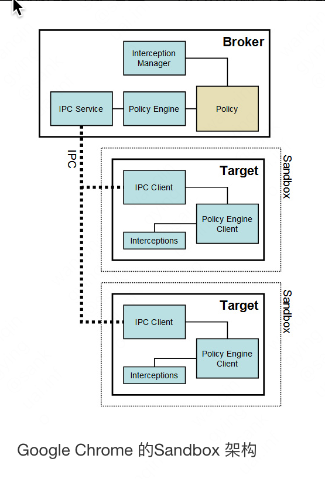

## 安全的基础

**信任边界是安全的基础**  
通过一个安全检查（过滤、净化）的过程，可以梳理未知的人或物，使其变得可信任。被划分出来的具有不同信任级别的区域，我们称为信任域，划分两个不同信任域之间的边界，我们称为信任边界。

数据从高等级的信任域流向低等级的信任域，是不需要经过安全检查的；数据从低等级的信任域流向高等级的信任域，则需要经过信任边界的安全检查。

**安全三要素**  
安全三要素是安全的基本组成元素

机密性（Confidentiality）
机密性要求保护数据内容不能泄露，加密是实现机密性要求的常见手段

完整性（Integrity）  
完整性则要求保护数据内容是完整、没有被篡改的。常见的保证一致性的技术手段是数字签名。

可用性（Availability）  
完整性则要求保护数据内容是完整、没有被篡改的。常见的保证一致性的技术手段是数字签名。  
例如Dos攻击导致服务不可用

## 安全的准则

**Secure By Default - 黑名单、白名单**  
**Secure By Default - 最小权限**  
**纵深防御**  
**数据与代码分离**  
**不可预测性**

## 客户端脚本安全

### 浏览器安全

**同源策略**    
同源策略（Same Origin Policy）是一种约定，它是浏览器最核心也最基本的安全功能  
参考文章 浏览器的同源策略


**浏览器沙箱Sandbox**  

Sandbox的设计目的一般是为了让不可信任的代码运行在一定的环境中，限制不可信任的代码访问隔离区之外的资源。如果一定要跨越Sandbox边界产生数据交换，则只能通过指定的数据通道，比如经过封装的API来完成，在这些API中会严格检查请求的合法性。  
浏览器采用Sandbox技术，可以让不受信任的代码运行在一个受限的环境中，从而保护本地桌面系统的安全。  
第三方插件仍然存在风险


**恶意网址拦截**  
浏览器厂商提供的黑名单


### 跨站脚本注入(XSS)

**简介**  
跨站脚本攻击，英文全称是 Cross Site Script，为了和层叠样式表（Cascading Style Sheet，CSS）区别，简称“XSS”    
XSS攻击，通常指黑客通过“HTML注入”篡改了网页，插入了恶意的脚本，从而在用户浏览网页时，控制用户浏览器的一种攻击。在一开始，这种攻击的演示案例是跨域的，所以叫做“跨站脚本”。但是发展到今天，由于JavaScript的强大功能以及网站前端应用的复杂化，是否跨域已经不再重要。但是由于历史原因，XSS这个名字却一直保留下来。

**反射型XSS**  
反射型XSS只是简单地把用户输入的数据“反射”给浏览器。也就是说，黑客往往需要诱使用户“点击”一个恶意链接，才能攻击成功。  
反射型XSS也叫做“非持久型XSS”（Non-persistent XSS）。


**存储型XSS**  
存储型XSS会把用户输入的数据“存储”在服务器端。这种XSS具有很强的稳定性。  
比较常见的一个场景就是，黑客写下一篇包含有恶意JavaScript代码的博客文章，文章发表后，所有访问该博客文章的用户，都会在他们的浏览器中执行这段恶意的JavaScript代码。黑客把恶意的脚本保存到服务器端，所以这种XSS攻击就叫做“存储型XSS”。  
存储型XSS通常也叫做“持久型XSS”(Persistent XSS)，因为从效果上来说，它存在的时间是比较长的。


### 跨站请求伪造(CSRF)
**简介**  
CSRF的全名是Cross Site Request Forgery，翻译成中文就是跨站点请求伪造。  
使用钓鱼链接B伪造A域名请求，会带上A域名的cookie执行操作。

**浏览器cookie策略SameSite**   
2020年左右，谷歌浏览器从84版本开始将默认值SameSite=None更新为SameSite=Lax
```html 
<p>Look at this amazing cat!</p>

<p>Read the <a href="https://blog.example/blog/cat.html">article</a>.</p>
```
- Strict: 都不会发送cookie  
  
- Lax: 图片不会，链接会发送cookie  
  
- None: 第三方cookie都会发送

#### 防御CSRF

**设置cookie同源策略SameSite**  
浏览器默认值是不确定的，应当手动设置一个安全的值  
但不能强制所有的网址都设置，所以只是辅助手段

**验证码**  
验证码被认为是对抗CSRF攻击最简洁而有效的防御方法  
网站不能给所有的操作都加上验证码。因此，验证码只能作为防御CSRF的一种辅助手段，而不能作为最主要的解决方案

**Referer Check**  
Referer Check在互联网中最常见的应用就是“防止图片盗链”。同理，Referer Check也可以被用于检查请求是否来自合法的“源”
Referer Check的缺陷在于，服务器并非什么时候都能取到Referer。很多用户出于隐私保护的考虑，限制了Referer的发送。在某些情况下，浏览器也不会发送Referer，比如从HTTPS跳转到HTTP，出于安全的考虑，浏览器也不会发送Referer。
可以通过Referer Check来监控CSRF攻击的发生

**Anti CSRF Token**  
攻击者只有预测出URL的所有参数与参数值，才能成功地构造一个伪造的请求；反之，攻击者将无法攻击成功。  
出于这个原因，可以想到一个解决方案：把参数加密，或者使用一些随机数，从而让攻击者无法猜测到参数值。这是“不可预测性原则”的一种应用（参考“我的安全世界观”一章）。


### 点击劫持  
点击劫持是一种视觉上的欺骗手段。攻击者使用一个透明的、不可见的iframe，覆盖在一个网页上，然后诱使用户在该网页上进行操作，此时用户将在不知情的情况下点击透明的iframe页面。通过调整iframe页面的位置，可以诱使用户恰好点击在iframe页面的一些功能性按钮上。  
跟CSRF类似，但在交互操作上更先进  
ClickJacking相对于XSS与CSRF来说，因为需要诱使用户与页面产生交互行为，因此实施攻击的成本更高，在网络犯罪中比较少见。

#### 防御ClickJacking

**禁止跨域iframe**  
在脚本里面frame busting  
```javascript 
if ( top.location != location ) {
top.location = self.location;
}
```
frame busting存在被绕过的可能

**X-Frame-Options**  
当值为DENY时，浏览器会拒绝当前页面加载任何frame页面  
若值为SAMEORIGIN，则frame页面的地址只能为同源域名下的页面  
若值为ALLOW-FROM，则可以定义允许frame加载的页面地址


### HTML5安全
HTML 5定义了很多新标签、新事件，这有可能带来新的XSS攻击。


## 服务器端应用安全

### 注入攻击
### 文件上传漏洞
### 认证与会话管理
### 访问控制
### 加密算法与随机数
### WEB框架安全
### 拒绝服务攻击
### Web Server配置安全


## 其他

### 物理安全
服务器安全，包括容灾、设备安全、政治法律等  
不深入讨论

### 网络协议安全
WEB层面一般指HTTPS协议，参考文章HTTP协议安全

### 制度和保障
用公司的规章制度和安全培训等手段保障人员层面的安全
不深入讨论
