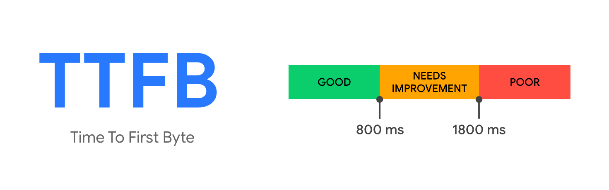
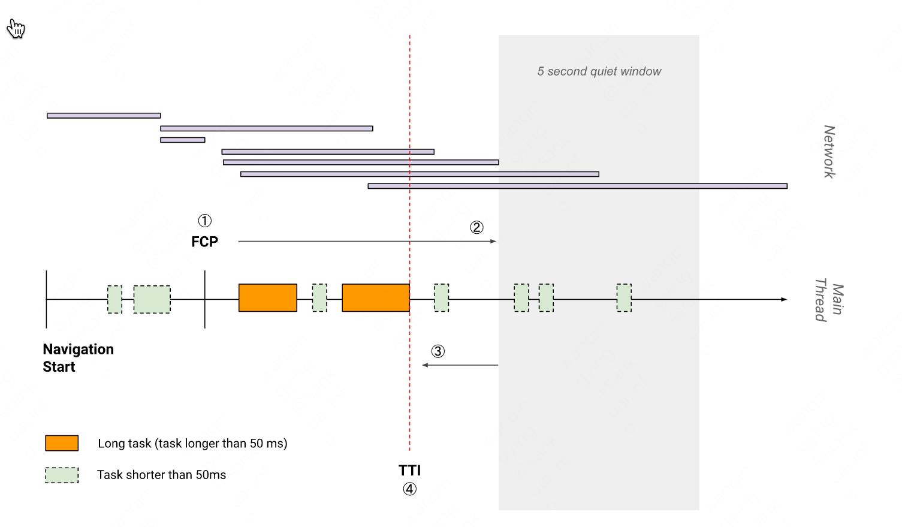

## 1. 概览

## 2. Time to First Byte 首字节时间(TTFB)

TTFB 是下列请求节点的时间损耗汇总：

- Redirect time 重定向时延
- Service worker 启动时延（如果适用）
- DNS 查询时延
- 建立连接和 TLS 所消耗时延
- 请求，直到响应的第一个字节到达为止的时延
- 减少连接建立和后端服务的时延将有助于降低 TTFB


### 2.1 什么是好的 TTFB

由于 TTFB 先于核心指标，根据 75 分位的 FCP 分数作为基准，TTFB 推荐少于 0.8 秒  


### 2.2 如何测量 TTFB

```javascript
//  直接测量，可以自定义逻辑
new PerformanceObserver((entryList) => {
  const [pageNav] = entryList.getEntriesByType("navigation");

  console.log(`TTFB: ${pageNav.responseStart}`);
}).observe({
  type: "navigation",
  buffered: true,
});

// 使用web-vitals兼容性更好
import { getTTFB } from "web-vitals";

getTTFB(console.log);
```

### 2.3 如何优化 TTFB

TTFB 在很大程度上取决于托管、后端服务和网络环境

- 优化服务器  
  适用于服务端渲染等场景，不深入讨论
- 使用 CDN 加速静态资源
- 使用 ServiceWorker 缓存 HTML 页面
- 尽早建立第三方连接  
  使用 rel="preconnect"或者 rel="dns-prefetch"来告知浏览器您的页面打算尽快建立连接
- 避免多次重定向
- 使用 HTTP/2 or HTTP/3

## 3. Time to Interactive 可交互时间 (TTI)

TTI 指标测量页面从开始加载到主要子资源完成渲染，并能够快速、可靠地响应用户输入所需的时间

### 3.1 概念

如需根据网页的性能跟踪计算 TTI，请执行以下步骤：

1. 先进行 First Contentful Paint 首次内容绘制 (FCP)。
2. 沿时间轴正向搜索时长至少为 5 秒的安静窗口，其中，安静窗口的定义为：没有长任务且不超过两个正在处理的网络 GET 请求。
3. 沿时间轴反向搜索安静窗口之前的最后一个长任务，如果没有找到长任务，则在 FCP 步骤停止执行。
4. TTI 是安静窗口之前最后一个长任务的结束时间（如果没有找到长任务，则与 FCP 值相同）。

如下图，阴影部分是安静窗口，窗口前面最近一个长任务结束时间即是 TTI  
如果没有长任务，则取 FCP 的时间  


### 3.2 改进 TTI 的常见方式

- 缩小 JavaScript
- 预连接到所需的来源
- 预加载关键请求
- 减少第三方代码的影响
- 最小化关键请求深度
- 减少 JavaScript 执行时间
- 最小化主线程工作
- 保持较低的请求数和较小的传输大小

## 4. Total Blocking Time 总阻塞时间 (TBT)

### 4.1 概念

TBT = TTI - FCP  
TBT 指标测量首次内容绘制 (FCP)与可交互时间 (TTI)之间的总时间  
这期间，主线程被阻塞的时间过长，无法作出输入响应。

## 5. Interaction to Next Paint 交互延迟(INP)
