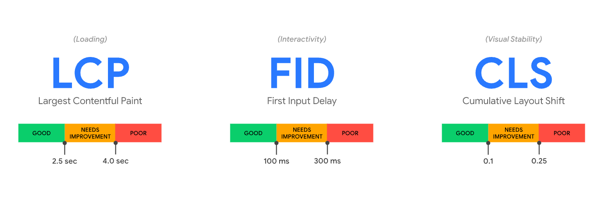

## 概览
Web 指标是 Google 开创的一项新计划，旨在为网络质量信号提供统一指导，这些信号对于提供出色的网络用户体验至关重要。

网站所有者要想了解他们提供给用户的体验质量，并非需要成为性能专家。 Web 指标计划旨在简化场景，帮助网站专注于最重要的指标，即核心 Web 指标 。

## 核心Web指标

### Largest Contentful Paint (LCP)
    最大内容绘制，测量加载性能。为了提供良好的用户体验，LCP 应在页面首次开始加载后的2.5 秒内发生。

### First Input Delay (FID)     
    首次输入延迟，测量交互性。为了提供良好的用户体验，页面的 FID 应为100 毫秒或更短。

### Cumulative Layout Shift (CLS) 
    累积布局偏移，测量视觉稳定性。为了提供良好的用户体验，页面的 CLS 应保持在 0.1. 或更少。

### 建议值
为了确保您能够在大部分用户的访问期间达成建议目标值，对于上述每项指标，一个良好的测量阈值为页面加载的第 75 个百分位数，且该阈值同时适用于移动和桌面设备。

## Largest Contentful Paint 最大内容绘制 (LCP)
最大内容绘制 (LCP) 指标会根据页面首次开始加载的时间点来报告可视区域内可见的最大图像或文本块完成渲染的相对时间。

### LCP考量的元素类型
- img元素
- 内嵌在svg元素内的image元素
- video元素（使用封面图像）
- 通过url()函数（而非使用CSS 渐变）加载的带有背景图像的元素
- 包含文本节点或其他行内级文本元素子元素的块级元素。  

### 如何确定一个元素的大小
最大内容绘制的元素大小通常是用户在可视区域内可见的大小。如果有元素延伸到可视区域之外，或者任何元素被剪裁或包含不可见的溢出，则这些部分不计入元素大小。  

通过 CSS 设置的任何边距、填充或边框都不在考量范围内。

### 何时报告最大内容绘制LCP
网页通常是分阶段加载的，因此，页面上的最大元素也可能会发生变化。

为了应对这种潜在的变化，浏览器会在绘制第一帧后立即分发一个largest-contentful-paint类型的PerformanceEntry，用于识别最大内容元素。但是，在渲染后续帧之后，浏览器会在最大内容元素发生变化时分发另一个PerformanceEntry。

### 测量LCP
使用PerformanceObserver可以策略，例外的情况：后台选项卡、往返缓存

