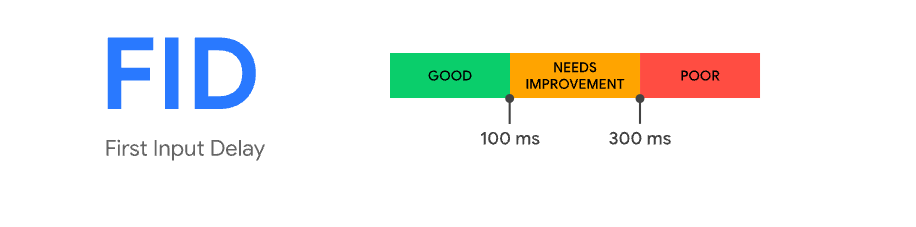
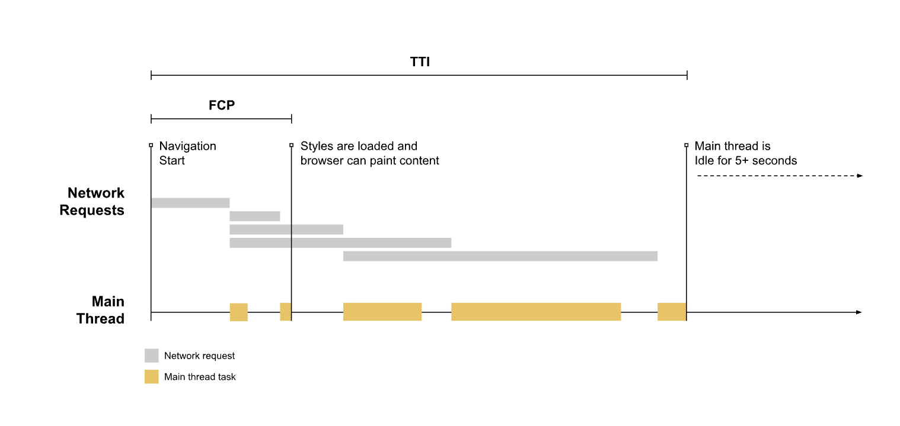

## 1. 核心 Web 指标


### 1.1 Largest Contentful Paint (LCP)

    最大内容绘制，测量加载性能。为了提供良好的用户体验，LCP 应在页面首次开始加载后的2.5 秒内发生。

### 1.2 First Input Delay (FID)

    首次输入延迟，测量交互性。为了提供良好的用户体验，页面的 FID 应为100 毫秒或更短。

### 1.3 Cumulative Layout Shift (CLS)

    累积布局偏移，测量视觉稳定性。为了提供良好的用户体验，页面的 CLS 应保持在 0.1. 或更少。

### 1.4 建议值

    为了确保您能够在大部分用户的访问期间达成建议目标值，对于上述每项指标，一个良好的测量阈值为页面加载的第 75 个百分位数，且该阈值同时适用于移动和桌面设备。

## 2. Largest Contentful Paint 最大内容绘制 (LCP)

最大内容绘制 (LCP) 指标会根据页面首次开始加载的时间点来报告可视区域内可见的最大图像或文本块完成渲染的相对时间。

### 2.1 LCP 考量的元素类型

- img 元素
- 内嵌在 svg 元素内的 image 元素
- video 元素（使用封面图像）
- 通过 url()函数（而非使用 CSS 渐变）加载的带有背景图像的元素
- 包含文本节点或其他行内级文本元素子元素的块级元素。

### 2.2 如何确定一个元素的大小

最大内容绘制的元素大小通常是用户在可视区域内可见的大小。如果有元素延伸到可视区域之外，或者任何元素被剪裁或包含不可见的溢出，则这些部分不计入元素大小。

通过 CSS 设置的任何边距、填充或边框都不在考量范围内。

### 2.3 何时报告最大内容绘制 LCP

网页通常是分阶段加载的，因此，页面上的最大元素也可能会发生变化。

为了应对这种潜在的变化，浏览器会在绘制第一帧后立即分发一个 largest-contentful-paint 类型的 PerformanceEntry，用于识别最大内容元素。但是，在渲染后续帧之后，浏览器会在最大内容元素发生变化时分发另一个 PerformanceEntry。

### 2.4 测量 LCP

使用 PerformanceObserver 可以测量，例外的情况：后台选项卡、往返缓存

```javascript
new PerformanceObserver((entryList) => {
  for (const entry of entryList.getEntries()) {
    console.log("LCP candidate:", entry.startTime, entry);
  }
}).observe({ type: "largest-contentful-paint", buffered: true });
```

考虑兼容性:

```javascript
import { getLCP } from "web-vitals";

// 当 LCP 可用时立即进行测量和记录。
getLCP(console.log);
```

### 2.4 性能优化之 LCP

LCP 主要受四个因素影响：

- 服务器响应速度
- JavaScript 和 CSS 渲染阻塞
- 资源加载时间
- 客户端渲染速度

参考文档: 性能优化-核心指标-LCP 优化

##  3. First Input Delay 首次输入延迟(FID)
首次输入延迟 (FID) 指标有助于衡量用户对网站交互性和响应度的第一印象  

FID 测量从用户第一次与页面交互（例如当他们单击链接、点按按钮或使用由 JavaScript 驱动的自定义控件）直到浏览器对交互作出响应，并实际能够开始处理事件处理程序所经过的时间。

P75分位值100毫秒最佳




### 3.1 FID概览

FID通常发生在FCP(首次内容绘制)和TTI(可交互时间)之间  
下图中，FCP和TTI之间有三个长任务，那么FID值是不确定的 
因此FID值需要查看分布情况  

首次输入延迟只考虑事件响应延迟，不包括事件处理花费的时间





### 3.2 哪些算是首次输入
FID 是测量页面加载期间响应度的指标。因此，FID 只关注不连续操作对应的输入事件，如点击、轻触和按键。  
而滚动、缩放等属于连续操作，不用来衡量FID


