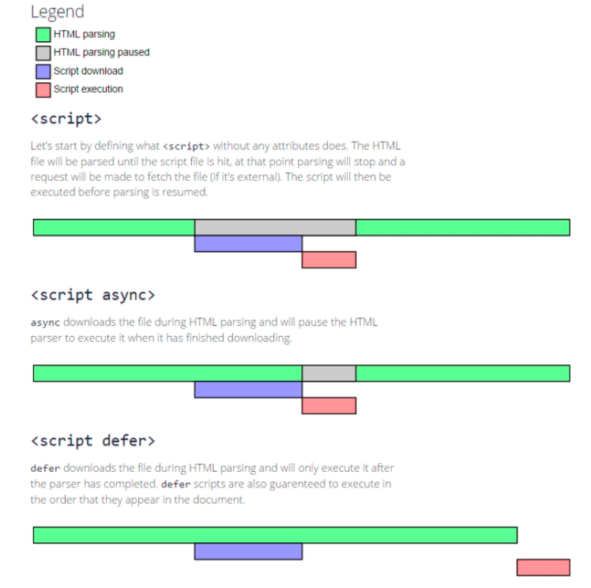
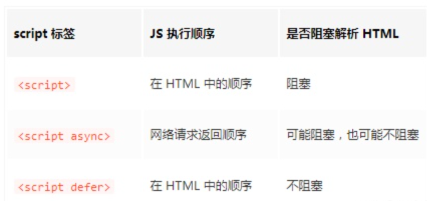

### sync - 同步脚本
- 下载：阻塞代码
- 执行：同步执行

### async - 异步脚本
- 下载：不阻塞代码
- 执行：立即同步执行
- 页面Load事件前执行，DOMContentLoaded事件顺序不确定
- 执行顺序依赖网络传输
- 不建议修改DOM，可能获取不到

### defer - 延迟脚本
- 下载：不阻塞代码
- 执行：页面解析完成后执行
- 建议只包含一个延迟脚本

### 加载顺序

### 执行顺序

### 注意
- 内联脚本都是同步脚本，包括动态生成的
- 内联代码可以用URL.createObjectURL 包装的 Blob 对象支持异步